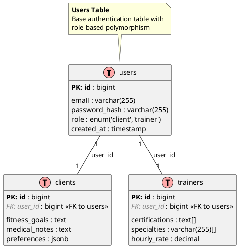

# Authentication

## US-1: As a user, I want to register in app via email to access relevant functionality

[API Specification](/docs/technical/auth-api.md)  

### Features:  

- #### Email + password registration:  
    **AC**  
    1. On app startup auth page is loaded  
    2. By default there is register form with following units: 
       - first name input
       - last name input
       - email input
       - password input
       - Client/Trainer radio buttons  
       - submit button
    3. By clicking on 'submit button' app sends register request. On success user need to be redirected to it's profile page. On error

- #### Role selection:  
  - Persistent choice (editable via support only)  

**2. Role-Specific Setup**  
*For Clients:*  
- [ ] Optional fields:  
  - Fitness goals dropdown (weight loss, muscle gain)  
  - Preferred workout types (multi-select)  

*For Trainers:*  
- [MVP] Required fields:  
  - Certification upload (PDF/IMG)  
  - Minimum 1 specialization selection  
- [ ] Optional fields:  
  - Portfolio gallery (max 5 images)  
  - Video introduction (URL)  

**3. Edge Cases**  
- [MVP] Email already exists:  
  - "Login instead" prompt  
  - Password recovery option  
- [ ] Partial profile completion:  
  - Warning: "Complete profile for full access"  
  - Dashboard reminder notifications  

